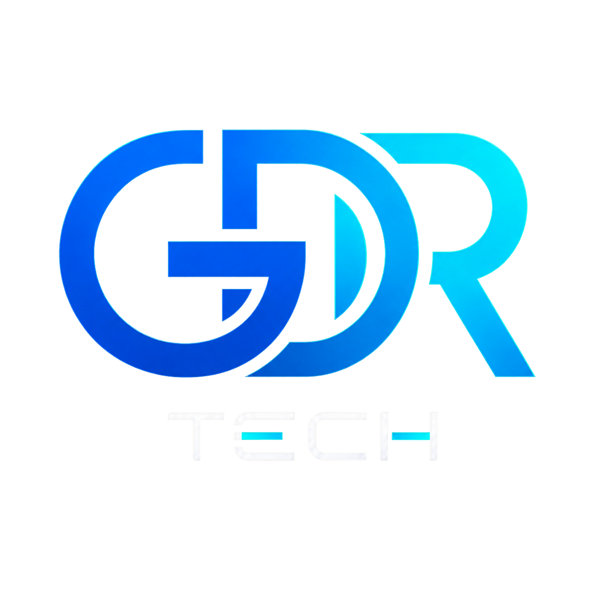

# Ruan Moreira

### Software Engineer • Co-Founder @ GDR Tech

Desenvolvendo **produtos digitais, aplicações web, automações e experiências orientadas a resultado**.

  
  
  

---

## 👋 Sobre mim

Sou **Engenheiro de Software** e cofundador da **GDR Tech**, empresa focada no desenvolvimento de soluções digitais para negócios.

Atuo na criação de produtos que unem **engenharia de software, experiência do usuário, automação e objetivos de negócio**.

Hoje trabalho principalmente com:

- 🚀 **Landing Pages de alta conversão**
- 🌐 **Sites institucionais e aplicações web**
- 🤖 **Chatbots e automações de atendimento**
- ⚙️ **Integrações, APIs e automação de processos**
- 🏗️ **Arquitetura e desenvolvimento de produtos SaaS**

Além da implementação técnica, busco entender o problema, a operação e o objetivo de cada projeto para desenvolver soluções que façam sentido além do código.

📍 Pirenópolis - GO

---

## 💡 Áreas de atuação

### 🌐 Web Development

Desenvolvimento de experiências digitais modernas, responsivas e orientadas a resultado.

- Landing Pages focadas em conversão
- Sites institucionais
- Interfaces responsivas
- Aplicações web
- Integrações com APIs
- Otimização de performance
- SEO técnico
- Experiência desktop e mobile

### 🤖 Automação & Chatbots

Desenvolvimento de soluções para automatizar atendimento e processos operacionais.

- Chatbots de atendimento
- Automação de fluxos
- Integração com APIs
- Integração com bancos de dados
- Controle de estados de usuários
- Jornadas automatizadas
- Integração entre bot e atendimento humano
- Recuperação e tratamento de fluxos pendentes

### 🏗️ Software Engineering

Desenvolvimento de sistemas com foco em organização, manutenção e evolução.

- Arquitetura Monolítica Modular
- APIs REST
- Serviços de apoio
- Bancos de dados relacionais
- Separação de responsabilidades
- Integração entre sistemas
- Desenvolvimento de produtos SaaS
- Modelagem de regras de negócio

---

# 🚀 Projetos & Cases

## 🏡 Chalé JK Piri

Landing page desenvolvida para apresentar o empreendimento **Chalé JK Piri** e conduzir visitantes aos canais de contato e reserva.

O projeto foi desenvolvido considerando diferentes fases do negócio, desde a apresentação inicial do empreendimento até a operação voltada para reservas.

### Principais características

- Interface responsiva para desktop e mobile
- Estrutura visual orientada à apresentação do empreendimento
- Experiência focada em conversão
- Jornada direcionada para contato e reservas
- Integração com WhatsApp e canais externos
- Otimização para dispositivos móveis
- Projeto publicado e em uso real

🔗 **Projeto em produção:**  
https://www.chalejkpiri.com.br/

---

## 🤖 Chatbot de Atendimento — Moreira e Gomes

Solução de atendimento automatizado desenvolvida para o supermercado **Moreira e Gomes**, operando em conjunto com a equipe humana através do WhatsApp.

O chatbot automatiza etapas recorrentes do atendimento enquanto mantém a possibilidade de transferência e continuidade com atendentes humanos.

### Funcionalidades e desafios tratados

- Fluxos automatizados de atendimento
- Controle de estado de clientes
- Integração com banco de dados
- Encaminhamento entre bot e atendentes humanos
- Recuperação automática de atendimentos pendentes
- Tratamento diferenciado para clientes recorrentes
- Regras específicas para operação de delivery
- Coleta de NPS e feedback de clientes
- Controle de frequência de avaliações
- Automação de encerramento de atendimentos
- Tratamento de mensagens e diferentes tipos de entrada
- Lógicas de recuperação para fluxos interrompidos

A solução está **em produção e sendo utilizada no atendimento real do supermercado**.

---

## 💻 Qota

O **Qota** é uma plataforma SaaS para gestão de multipropriedade e bens compartilhados.

O projeto envolve diferentes áreas de engenharia de software, desde a experiência do usuário até arquitetura backend, persistência de dados e processamento automatizado de documentos.

### Arquitetura e tecnologias

- Arquitetura Monolítica Modular
- Frontend com React
- TypeScript
- Backend com Node.js
- APIs REST
- PostgreSQL
- Prisma ORM
- Microsserviço para processamento de documentos
- OCR utilizando Tesseract
- Processamento de imagens com OpenCV
- Integração entre diferentes serviços

O Qota representa um dos meus principais projetos de engenharia e uma aplicação prática de **arquitetura de software, desenvolvimento Full Stack e integração entre serviços**.

---

# 🏢 GDR Tech

Sou cofundador da **GDR Tech**, empresa de desenvolvimento de soluções digitais.

A empresa atua principalmente na criação de:

- 🚀 Landing Pages de alta conversão
- 🌐 Sites institucionais
- 💻 Aplicações web
- 🤖 Chatbots de atendimento
- ⚙️ Automações
- 🔗 Integrações entre sistemas

Nosso objetivo é desenvolver soluções que combinem:

**tecnologia + experiência do usuário + estratégia digital + resultado de negócio**

---

# 🛠️ Tecnologias & Ferramentas

## Frontend

  
  
  
  

## Backend & Arquitetura

  
  
  

## Dados & Automação

  
  
  
  

## Ferramentas & Deploy

  
  
  

---

# 📊 GitHub

  
  

---

# 🎓 Formação

🎓 **Bacharel em Engenharia de Software**  
UniEvangélica

---

## 📫 Vamos construir algo?

Desenvolvimento web, produtos digitais, automações e soluções de atendimento.

  
  
  

**GDR Tech — Desenvolvimento de soluções digitais para negócios.**

